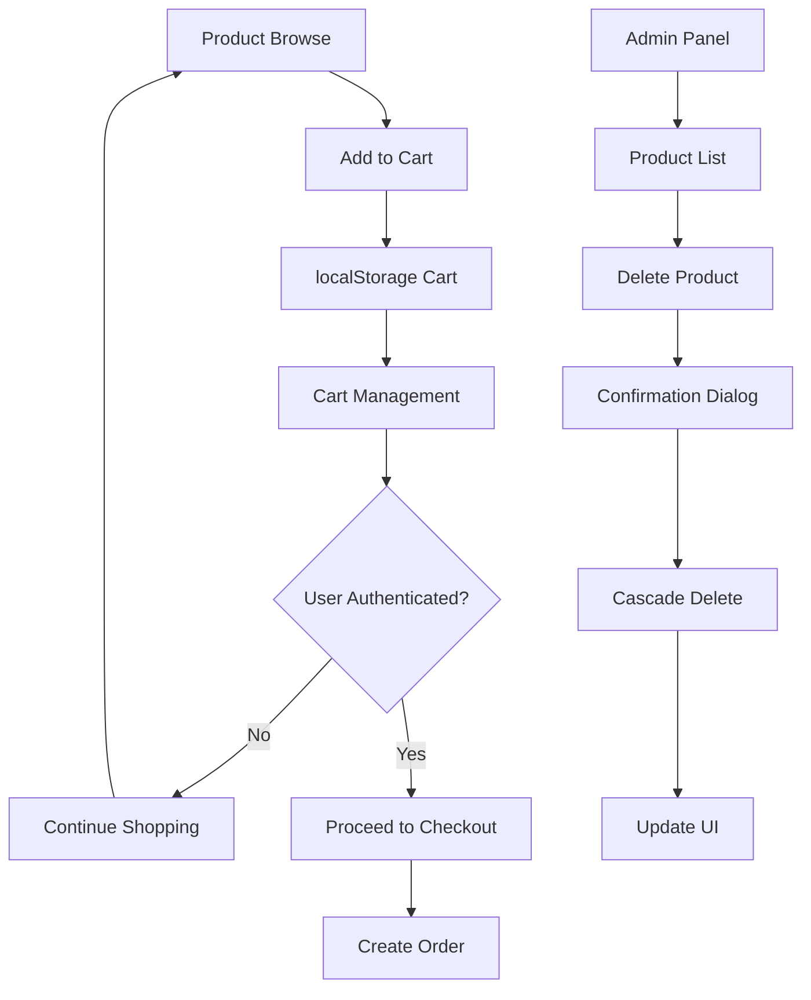

# Critical Issues Fix Requirements - Zimunda Estate Booking Platform

## 1. Product Overview

This document outlines the comprehensive solution for fixing critical issues in the Zimunda Estate Booking Platform, focusing on product deletion functionality, cart system migration from server-side to client-side, and thorough code cleanup to ensure a robust and user-friendly e-commerce experience.

The main problems to solve include missing database models causing runtime errors, incomplete product deletion functionality, server-dependent cart system that should be publicly accessible, and various code inconsistencies that affect maintainability and user experience.

## 2. Core Features

### 2.1 User Roles

| Role | Registration Method | Core Permissions |
|------|---------------------|------------------|
| Public User | No registration required | Can browse products, manage cart (localStorage), view product details |
| Authenticated User | Email registration | All public permissions + order placement, order history |
| Admin/Manager | Admin invitation | All user permissions + product management, deletion, inventory control |

### 2.2 Feature Module

Our critical fixes consist of the following main areas:
1. **Database Schema Fixes**: Missing CartItem model addition and cascade delete configuration
2. **Product Management**: Complete product deletion with variants and proper UI confirmation dialogs
3. **Cart System Migration**: Server-side to client-side cart using localStorage for public access
4. **Code Cleanup**: Removal of unused server cart APIs and consistency improvements
5. **Error Handling**: Comprehensive error handling and user feedback systems

### 2.3 Page Details

| Page Name | Module Name | Feature description |
|-----------|-------------|---------------------|
| Admin Products | Product Deletion | Add delete confirmation dialog with proper cascade handling for variants, images, and cart references |
| Admin Products | Product Management | Enhance product listing with proper delete buttons and status indicators |
| Shop Pages | Cart System | Migrate to localStorage-based cart accessible to all users without authentication |
| Product Pages | Cart Integration | Update add-to-cart functionality to work with new client-side cart system |
| Cart Pages | Cart Management | Implement client-side cart operations (add, update, remove, clear) with persistence |
| Checkout Pages | Cart Validation | Add client-side cart validation before checkout process |

## 3. Core Process

### Admin Product Deletion Flow
1. Admin navigates to products list page
2. Admin clicks delete button on product row
3. System shows confirmation dialog with product details and impact warning
4. Admin confirms deletion
5. System performs cascade delete (variants, images, cart references)
6. System shows success message and refreshes product list

### Public Cart Management Flow
1. User browses products (no authentication required)
2. User adds products to cart (stored in localStorage)
3. Cart persists across browser sessions
4. User can view, modify, and manage cart items
5. For checkout, user must authenticate
6. Cart data transfers to order system upon successful authentication

## 4. User Interface Design

### 4.1 Design Style
- Primary colors: Blue (#3B82F6) and Green (#10B981) for actions
- Secondary colors: Red (#EF4444) for destructive actions, Gray (#6B7280) for neutral
- Button style: Rounded corners with subtle shadows
- Font: Inter or system fonts, 14px base size
- Layout style: Card-based design with consistent spacing
- Icons: Lucide React icons for consistency

### 4.2 Page Design Overview

| Page Name | Module Name | UI Elements |
|-----------|-------------|-------------|
| Admin Products | Delete Confirmation | Modal dialog with red accent, product details, warning text, and confirm/cancel buttons |
| Admin Products | Product Actions | Dropdown menu with edit/view/delete options, delete option in red with trash icon |
| Shop Pages | Cart Icon | Floating cart icon with item count badge, accessible from all pages |
| Cart Pages | Cart Items | Card-based layout with product images, quantity controls, and remove buttons |
| Product Pages | Add to Cart | Prominent green button with loading states and success feedback |

### 4.3 Responsiveness
The solution is mobile-first with responsive design for all cart and product management interfaces. Touch-friendly buttons and swipe gestures for mobile cart management are included.