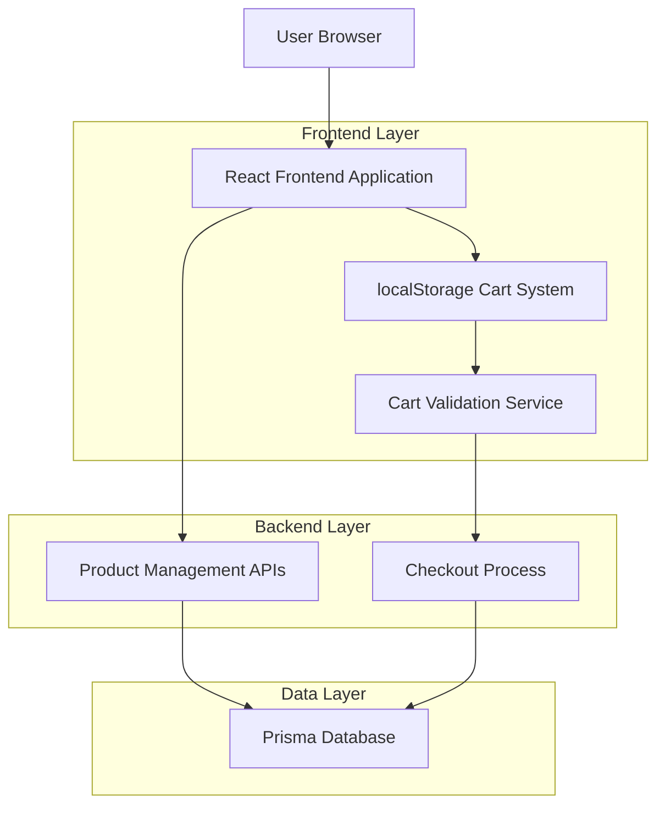
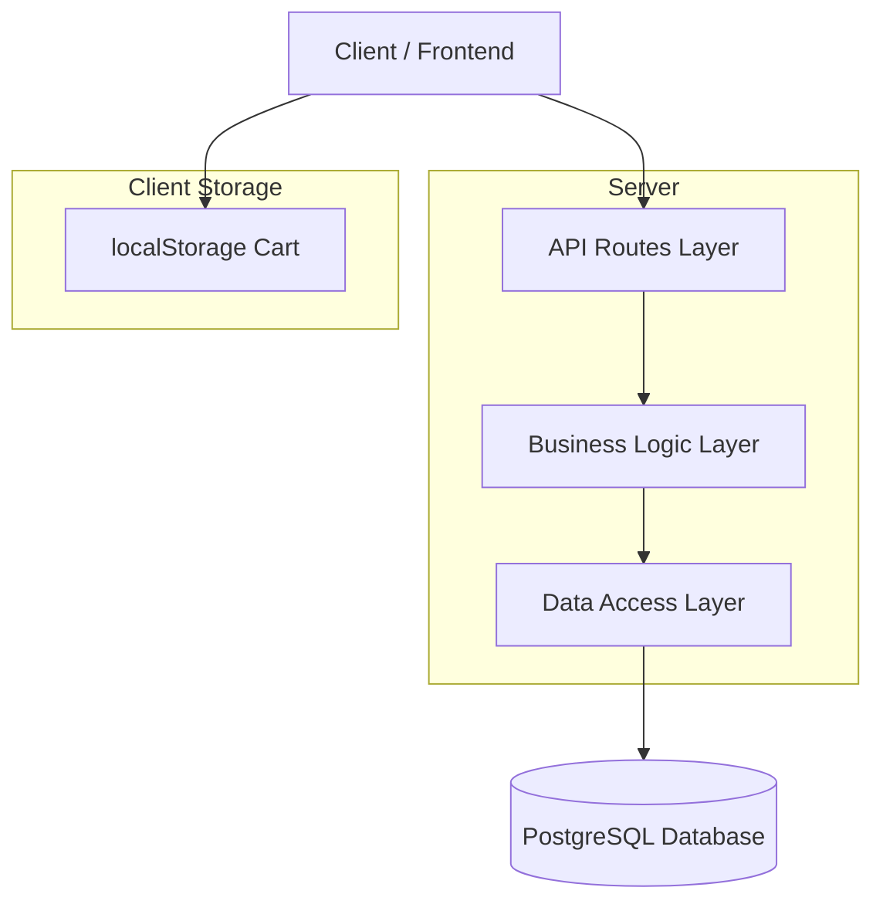
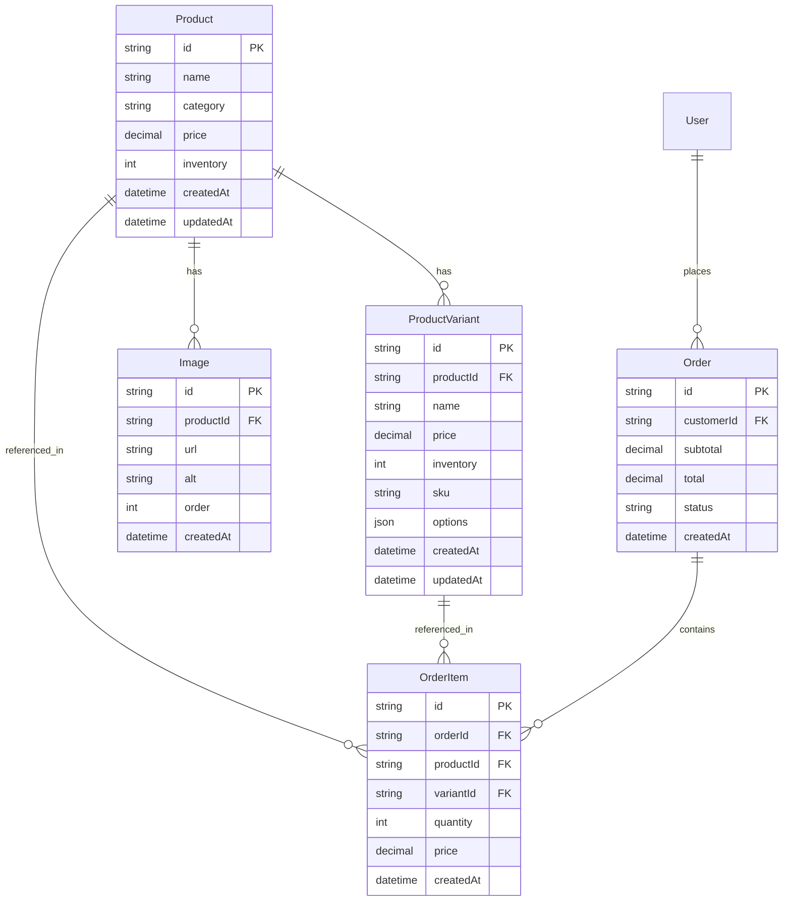

# Technical Architecture Fix Implementation

## 1. Architecture Design



## 2. Technology Description

- Frontend: React@18 + TypeScript + tailwindcss@3 + vite
- Backend: Next.js API Routes + Prisma ORM
- Database: PostgreSQL with updated schema
- Storage: localStorage for cart persistence
- State Management: React hooks with custom cart hook

## 3. Route Definitions

| Route | Purpose |
|-------|---------|
| /shop | Public shop page with client-side cart integration |
| /cart | Public cart management page using localStorage |
| /checkout | Authenticated checkout process with cart validation |
| /admin/products | Admin product management with delete functionality |
| /admin/products/[id] | Product details with delete option |
| /admin/products/[id]/edit | Product editing interface |
| /api/products/[id] | Enhanced DELETE endpoint with cascade handling |

## 4. API Definitions

### 4.1 Core API

**Product Deletion**
```
DELETE /api/products/[id]
```

Request: No body required, ID from URL params

Response:
| Param Name | Param Type | Description |
|------------|------------|-------------|
| success | boolean | Deletion status |
| message | string | Success/error message |
| deletedItems | object | Count of deleted related items |

Example Response:
```json
{
  "success": true,
  "message": "Product deleted successfully",
  "deletedItems": {
    "variants": 3,
    "images": 5,
    "cartReferences": 12
  }
}
```

**Cart Validation (for checkout)**
```
POST /api/cart/validate-items
```

Request:
| Param Name | Param Type | isRequired | Description |
|------------|------------|------------|-------------|
| items | array | true | Cart items from localStorage |

Response:
| Param Name | Param Type | Description |
|------------|------------|-------------|
| valid | boolean | Overall validation status |
| issues | array | List of validation issues |
| updatedItems | array | Items with current pricing/availability |

## 5. Server Architecture Diagram



## 6. Data Model

### 6.1 Data Model Definition



### 6.2 Data Definition Language

**Remove CartItem Model References (Cleanup)**
```sql
-- Remove any existing CartItem table if it exists
DROP TABLE IF EXISTS "CartItem" CASCADE;

-- Update Product model to handle cascade deletes properly
-- This is handled by Prisma schema updates, not direct SQL
```

**Enhanced Product Deletion Constraints**
```sql
-- Ensure proper cascade handling for product deletion
-- Add indexes for better performance on deletion operations
CREATE INDEX IF NOT EXISTS idx_product_variant_product_id ON "ProductVariant"(product_id);
CREATE INDEX IF NOT EXISTS idx_image_product_id ON "Image"(product_id);
CREATE INDEX IF NOT EXISTS idx_order_item_product_id ON "OrderItem"(product_id);
CREATE INDEX IF NOT EXISTS idx_order_item_variant_id ON "OrderItem"(variant_id);

-- Add constraint to prevent deletion of products with existing orders
-- This will be handled in application logic, not database constraints
```

**Updated Prisma Schema Changes**
```prisma
model Product {
  id          String           @id @default(cuid())
  name        String           @unique
  category    ProductCategory
  description String
  price       Decimal
  variants    ProductVariant[]
  inventory   Int
  images      Image[]
  orders      OrderItem[]      // Updated relationship
  isActive    Boolean          @default(true)  // Add soft delete capability
  createdAt   DateTime         @default(now())
  updatedAt   DateTime         @updatedAt
}

model ProductVariant {
  id         String      @id @default(cuid())
  productId  String
  name       String
  price      Decimal
  inventory  Int
  sku        String      @unique
  options    Json
  isActive   Boolean     @default(true)  // Add soft delete capability
  product    Product     @relation(fields: [productId], references: [id], onDelete: Cascade)
  orderItems OrderItem[]
  createdAt  DateTime    @default(now())
  updatedAt  DateTime    @updatedAt
}

model Image {
  id         String    @id @default(cuid())
  url        String
  alt        String?
  caption    String?
  order      Int       @default(0)
  propertyId String?
  productId  String?
  activityId String?
  property   Property? @relation(fields: [propertyId], references: [id], onDelete: Cascade)
  product    Product?  @relation(fields: [productId], references: [id], onDelete: Cascade)
  activity   Activity? @relation(fields: [activityId], references: [id], onDelete: Cascade)
  createdAt  DateTime  @default(now())
}
```

**Client-Side Cart Interface**
```typescript
interface CartItem {
  id: string;
  productId: string;
  variantId?: string;
  name: string;
  price: number;
  quantity: number;
  image?: string;
  maxQuantity: number;
  inStock: boolean;
}

interface CartSummary {
  items: CartItem[];
  subtotal: number;
  itemCount: number;
  totalQuantity: number;
}
```